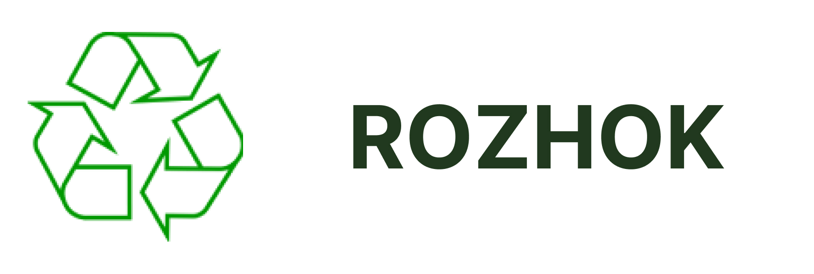
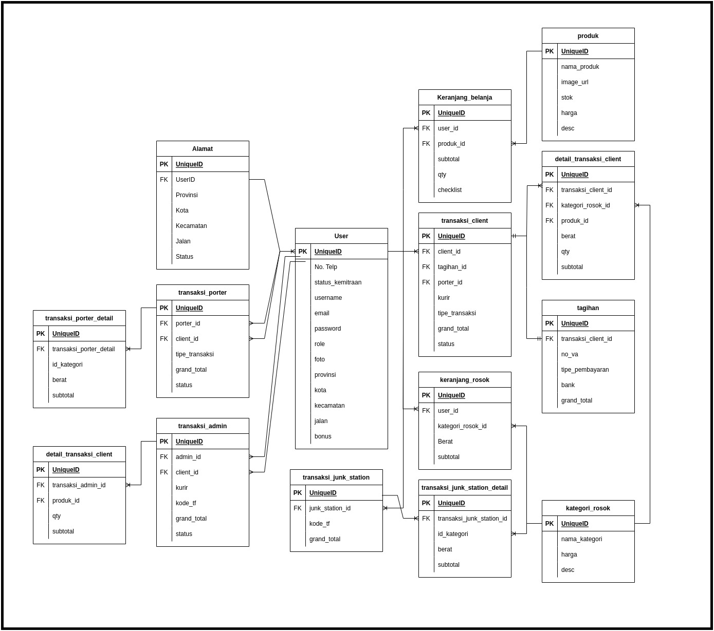

<!-- Improved compatibility of back to top link: See: https://github.com/othneildrew/Best-README-Template/pull/73 -->

<!--
*** Thanks for checking out the Best-README-Template. If you have a suggestion
*** that would make this better, please fork the repo and create a pull request
*** or simply open an issue with the tag "enhancement".
*** Don't forget to give the project a star!
*** Thanks again! Now go create something AMAZING! :D
-->

<!-- PROJECT SHIELDS -->
<!--
*** I'm using markdown "reference style" links for readability.
*** Reference links are enclosed in brackets [ ] instead of parentheses ( ).
*** See the bottom of this document for the declaration of the reference variables
*** for contributors-url, forks-url, etc. This is an optional, concise syntax you may use.
*** https://www.markdownguide.org/basic-syntax/#reference-style-links
-->
[![Contributors][contributors-shield]][contributors-url]
[![Forks][forks-shield]][forks-url]
[![Stargazers][stars-shield]][stars-url]
[![Issues][issues-shield]][issues-url]

<!-- PROJECT LOGO -->
 

  

  <h3 align="center">Rozhok API</h3>

  

    Rozhok is an application for selling your unused trash
     
    <a href="https://docs.google.com/document/d/1C6avfoYecdVqt_RNn5C1P1A_d1aBhMVr75pZpmOHDY4/edit?usp=sharing"><strong>Explore the docs »</strong></a>
     
     
    <a href="https://github.com/capstone-rozhok-app/backend/issues">Report Bug</a>
    ·
    <a href="https://github.com/capstone-rozhok-app/backend/issues">Request Feature</a>
  

<!-- TABLE OF CONTENTS -->

  
Table of Contents

  <ol>
    <li>
      <a href="#about-the-project">About The Project</a>
      <ul>
        <li><a href="#built-with">Built With</a></li>
      </ul>
    </li>
    <li><a href="#feature">Feature</a></li>
    <li><a href="#erd">Database Design</a></li>
    <li><a href="#swagger">Open API: Swagger</a></li>
    <li><a href="#contributors">Contributors</a></li>
  
  </ol>

<!-- ABOUT THE PROJECT -->
## About The Project

Society in general has waste, whether it's organic or inorganic waste, when the waste from the community is not used it will become waste (can't be recycled itself) so people sell it to garbage collectors.
Sometimes we as a society are lazy to go to collectors or don't know the collector's number, from the collector's point of view, traveling around offers their services, and sometimes they are refused to offer services in housing complexes.

Here's why:
- From the problems of the community and collectors, I created a solution in the form of the Rozhok Application, which is a platform that brings together the community (clients) as waste providers who will accept sales of waste in cash and collectors (porters) as driver partners who buy garbage/waste from the community, and also ( junk station) which is a place where garbage is sold by porters (TPA).

(<a href="#readme-top">back to top</a>)

### Built With

This the tech stack that we used for develope Backend Rozhok Apps

* [![AWS][aws]][aws-url]
* [![Golang][golang]][golang-url]
* [![Echo][echo]][echo-url]
* [![S3][s3]][s3-url]

(<a href="#readme-top">back to top</a>)

<!-- FEATURE -->
## Feature
We have 4 roles that is:
- Client
    - Buy a product from an UMKM (small shop that sell product).
    - Selling Unused trash from your house.
    - Get a bonuses after selling a trash.
- Junk Station
    - Buying a trash from porter
- Porter 
    - Buying trash from client
    - selling to junk station
- admin
    - Create UMKM product
    - Create Porter
    - Verication Junk Station

(<a href="#readme-top">back to top</a>)

<!-- ERD -->
## ERD

 

  

(<a href="#readme-top">back to top</a>)

<!-- Swagger -->
## Swagger

 

  <a href="https://app.swaggerhub.com/apis/vizucode/capstone-rozhok/1.0.0">
  Swagger Open API
  </a>

(<a href="#readme-top">back to top</a>)

<!-- Contributors -->
## Contributors

Havis Iqbal Syahrunizar - [@hirasakavizu](https://twitter.com/hirasakavizu) - havisikkubaru@gmail.com

Github: [https://github.com/arch-havis](https://github.com/arch-havis)

[![linkedinhavis][linkedinhavis-shield]][linkedinhavis-url]

(<a href="#readme-top">back to top</a>)

<!-- MARKDOWN LINKS & IMAGES -->
<!-- https://www.markdownguide.org/basic-syntax/#reference-style-links -->

[contributors-shield]: https://img.shields.io/github/contributors/capstone-rozhok-app/backend.svg?style=for-the-badge
[contributors-url]: https://github.com/capstone-rozhok-app/backend/graphs/contributors

[forks-shield]: https://img.shields.io/github/forks/capstone-rozhok-app/backend.svg?style=for-the-badge
[forks-url]: https://github.com/capstone-rozhok-app/backend/network/members

[stars-shield]: https://img.shields.io/github/stars/capstone-rozhok-app/backend.svg?style=for-the-badge
[stars-url]: https://github.com/capstone-rozhok-app/backend/stargazers

[issues-shield]: https://img.shields.io/github/issues/capstone-rozhok-app/backend.svg?style=for-the-badge
[issues-url]: https://github.com/capstone-rozhok-app/backend/issues

[linkedinhavis-shield]: https://img.shields.io/badge/-LinkedIn-black.svg?style=for-the-badge&logo=linkedin&colorB=555
[linkedinhavis-url]: https://www.linkedin.com/in/havis-iqbal/

[echo]: https://img.shields.io/badge/Echo-00ADD8?style=for-the-badge&logo=images/echo-logo&logoColor=FF3E00
[echo-url]: https://echo.labstack.com/

[s3]: https://img.shields.io/badge/S3-569A31?style=for-the-badge&logo=amazons3&logoColor=white
[s3-url]: https://aws.amazon.com/s3/

[aws]: https://img.shields.io/badge/AWS-FF9900?style=for-the-badge&logo=amazonaws&logoColor=white
[aws-url]: https://aws.amazon.com/

[golang]: https://img.shields.io/badge/golang-00ADD8?style=for-the-badge&logo=go&logoColor=white
[golang-url]: https://go.dev/